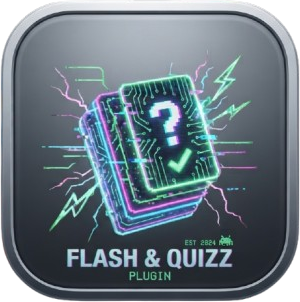

  

# Flash & Quizz for Obsidian

    

An Obsidian plugin to create and study interactive flashcards and quizzes directly from your notes, with spaced repetition.

---

## Features

- Vault-wide scanning: detects all flashcard and quiz blocks across your entire vault.
- Central Library view to access all study material in one place.
- SM-2 spaced repetition algorithm (Anki-compatible).
- Two modes: Random (quick review) or SRS (due items only).
- Progress stats: total, due, and learned item counts.
- Full-width modals with staggered animations.
- Banner images on launchers.
- Multilingual: English, French, German, Spanish, Chinese, Japanese, Portuguese.

---

## Syntax

Flashcards and quizzes use `flashcard` and `quizz` code blocks inside your notes. Content is stored as JSON within the block or in an external file.

---

## Commands

| Command | Description |
|---------|-------------|
| Open Flash & Quizz Library | Open the central study hub |
| Launch All Flashcards (Vault) | Study all flashcards |
| Launch All Quizzes (Vault) | Study all quizzes |

---

## Installation

Search for **Flash&Quizz** in Obsidian's Community Plugins browser.

---

## Star History

<a href="https://www.star-history.com/?repos=infinition%2Fobsidian-flash-quizz&type=date&legend=top-left">
 <picture>
   <source media="(prefers-color-scheme: dark)" srcset="https://api.star-history.com/chart?repos=infinition/obsidian-flash-quizz&type=date&theme=dark&legend=top-left" />
   <source media="(prefers-color-scheme: light)" srcset="https://api.star-history.com/chart?repos=infinition/obsidian-flash-quizz&type=date&legend=top-left" />
   
 </picture>
</a>

---

## License

MIT. See [LICENSE](LICENSE).
